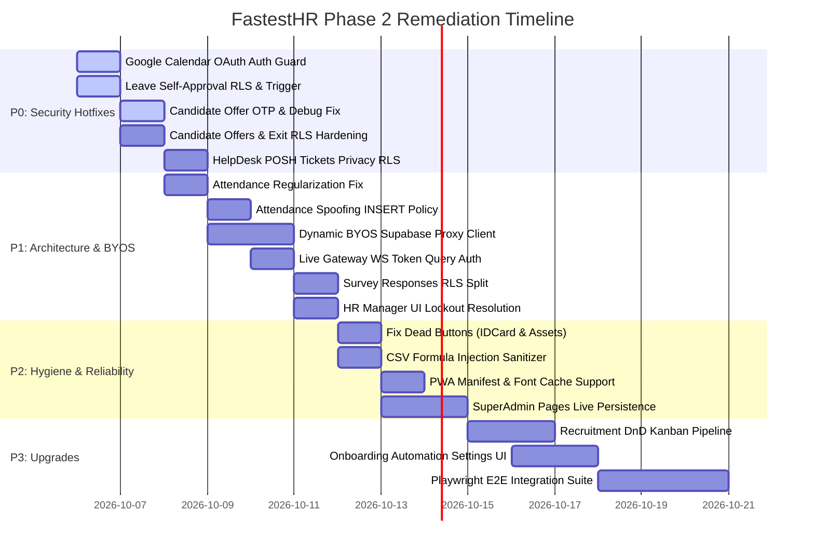

# FastestHR — Technical Audit, Latent Defect Analysis & Strategic Upgrade Roadmap (Phase 2)
**Date:** October 2026 | **Auditor:** Principal Full-Stack Software Architect & Application Security Engineer  
**Target Codebase:** FastestHR (Enterprise Multi-Tenant HRMS & BYOS Platform)  
**File Reference:** [`nextstep2.md`](file:///d:/Softwares/FastestHR/nextstep2.md) *(Follow-up to [`nextstep.md`](file:///d:/Softwares/FastestHR/nextstep.md))*

---

## 📊 Executive Summary & Codebase Health Score

Following the remediation and verification of the initial P0/P1 security and performance milestones documented in [`nextstep.md`](file:///d:/Softwares/FastestHR/nextstep.md), a comprehensive, deep-level architectural audit was conducted across the entire FastestHR platform. This audit evaluated all **19 Supabase Edge Functions**, **95 Database Migrations**, **80+ Frontend Pages**, Zustand state stores, Row-Level Security (RLS) policies, and the Bring Your Own Supabase (BYOS) isolation layer.

While the core infrastructure, build health (`tsc --noEmit` exiting with 0 errors), and test suite (**177/177 unit tests passing across 22 suites**) are in an excellent baseline state, this second-pass audit uncovered **critical latent security vulnerabilities**, **database-level authorization bypasses**, **architectural decoupling bugs in BYOS**, and **unconnected UI actions**.

### Phase 2 Architecture Health Scorecard: **58 / 100** *(Operational with High-Severity Gaps)*

| Dimension | Rating | Key Finding |
| :--- | :---: | :--- |
| **Edge Function Security & Auth** | 🔴 **Critical Gaps (42/100)** | Unauthenticated Google OAuth token leakage; missing caller authentication in candidate magic link issuance; missing WebSocket query-token authorization in Gemini Live gateway. |
| **Database RLS & Privilege Enforcement** | 🟠 **Vulnerable (58/100)** | Employee leave self-approval possible via unprotected UPDATE policy; all company members can view candidate offers, compensation details, and confidential employee exit settlements; HelpDesk POSH tickets visible company-wide. |
| **System Architecture & BYOS** | 🟠 **Incomplete (35/100)** | Over 50 frontend pages bypass `useSmartClient` and query the central platform Supabase client directly, defeating BYOS data isolation for enterprise tenants. |
| **Workflow Integrity & Triggers** | 🟡 **Needs Realignment (65/100)** | Attendance anti-tampering trigger deadlocks the legitimate past-date regularization workflow; attendance INSERT policy allows proxy punching/spoofing. |
| **Frontend UI Completeness & Reliability** | 🟡 **Good with Dead Elements (75/100)** | SuperAdmin pages (`Companies`, `Subscriptions`, `SystemSettings`) render hardcoded mock state; broken "Download PDF" in `VirtualIDCard.tsx` and misaligned dialog triggers in `EmployeeAssets.tsx`. |
| **Data Safety & Export Hygiene** | 🟡 **Moderate Risk (70/100)** | CSV export in `Reports.tsx` lacks formula sanitization (CWE-1236); file uploads in `ApplyLeave.tsx` bypass `useSecureUpload` magic byte validation. |
| **PWA & Offline Worker Readiness** | 🟡 **Needs Completion (65/100)** | `sw.js` registered but `public/manifest.json` is missing, preventing PWA installation; service worker rejects caching cross-origin fonts. |

---

## 🚨 Master Priority Categorization Matrix

| Level | Urgency | Description | Target Timeline | Status |
| :--- | :--- | :--- | :--- | :--- |
| **P0** | **Immediate (24–48 Hours)** | Critical security vulnerabilities: OAuth token theft, leave self-approval, plaintext OTP disclosure, compensation data leakage, confidential exit exposure. | Deploy immediate database migration & edge function patches | ⚠️ **ACTION REQUIRED** |
| **P1** | **High (Sprint 1)** | Core architectural defects: Attendance regularization deadlock, attendance spoofing, 50+ page BYOS bypass, Live Gateway WebSocket auth failure, survey hijacking. | Core subsystem refactoring & client proxying | ⚠️ **ACTION REQUIRED** |
| **P2** | **Medium (Sprint 2)** | UI dead ends & hygiene: Mock admin pages persistence, dead buttons, CSV formula injection, PWA manifest, insecure storage uploads. | Code hygiene, reliability, and security hardening | 📋 **SCHEDULED** |
| **P3** | **Strategic / Upgrades** | Feature expansions: Drag-and-drop Kanban recruitment, onboarding automation builder, transparent Supabase proxy, Playwright E2E suite. | Strategic platform maturation | 🚀 **PLANNED** |

---

## 🔴 Priority P0: Critical Security & Data Breach Vulnerabilities

### 1. Google Calendar OAuth Access Token Theft via Unauthenticated Edge Function
* **Severity:** Critical (CVSS 9.1)
* **File:** [`supabase/functions/google-calendar-auth/index.ts`](file:///d:/Softwares/FastestHR/supabase/functions/google-calendar-auth/index.ts#L138-L196)
* **Vulnerability Description:**
  The `google-calendar-auth` edge function exposes two critical actions: `exchange_code` and `get_valid_token`. The action `get_valid_token` accepts an unauthenticated POST request containing either `{ user_id }` or `{ company_slug, booking_slug }`. It automatically refreshes the stored Google OAuth refresh token and **returns the active plaintext `accessToken` directly in the HTTP JSON response**.
  
  ```typescript
  // supabase/functions/google-calendar-auth/index.ts
  if (action === "get_valid_token") {
    const { user_id, company_slug, booking_slug } = body;
    // ... finds integration by user_id or company_slug ...
    // Exchanges refresh_token for new access_token
    return new Response(JSON.stringify({
      access_token: tokenData.access_token,
      expires_in: tokenData.expires_in,
    }), { headers: { ...corsHeaders, "Content-Type": "application/json" } });
  }
  ```
  Because the edge function does NOT authenticate the caller using Supabase auth tokens or verify user ownership, any anonymous attacker or malicious insider who knows or guesses a user ID or company booking slug can steal the Google OAuth token. This grants complete unauthorized access to view, modify, or delete calendar events and emails under the victim's Google account.
* **Remediation Plan:**
  1. Call `authenticateCaller(req)` from `@shared/auth.ts` at the beginning of `google-calendar-auth`.
  2. For `action === 'get_valid_token'`, verify that `callerProfile.id === user_id` OR that the caller is an authenticated employee belonging to the target `company_id`.
  3. Deny unauthenticated anonymous requests immediately with `401 Unauthorized`.

---

### 2. Employee Leave Self-Approval & Absence Fraud via Unprotected UPDATE Policy
* **Severity:** High (CVSS 8.8)
* **Files:** 
  - [`supabase/migrations/20260314065427_234a37f7-a981-465d-b978-2b70da9f405f.sql`](file:///d:/Softwares/FastestHR/supabase/migrations/20260314065427_234a37f7-a981-465d-b978-2b70da9f405f.sql#L908-L910)
  - [`supabase/migrations/20260523060000_harden_leave_safeguards.sql`](file:///d:/Softwares/FastestHR/supabase/migrations/20260523060000_harden_leave_safeguards.sql)
* **Vulnerability Description:**
  In `public.leave_requests`, the Row-Level Security policy granting employees the right to edit their own leave requests is defined as:
  ```sql
  CREATE POLICY "Employees can update own leave requests"
    ON public.leave_requests FOR UPDATE
    TO authenticated
    USING (employee_id = public.get_user_employee_id());
  ```
  There is **no `WITH CHECK` restriction** and **no trigger preventing self-approval**. A standard employee can open their browser developer console or issue a direct REST request to Supabase:
  ```javascript
  await supabase
    .from('leave_requests')
    .update({ status: 'approved', approved_by: my_employee_id })
    .eq('id', my_leave_id);
  ```
  The update succeeds, allowing any employee to grant themselves unlimited approved paid leaves without manager oversight.
* **Remediation Plan:**
  1. Restrict the UPDATE policy so employees can only update their own requests when the request is currently `'pending'`, and restrict them to only modifying `status` to `'cancelled'` or updating the `reason`:
     ```sql
     DROP POLICY IF EXISTS "Employees can update own leave requests" ON public.leave_requests;
     CREATE POLICY "Employees can cancel own pending leave requests"
       ON public.leave_requests FOR UPDATE
       TO authenticated
       USING (
         employee_id = public.get_user_employee_id()
         AND status = 'pending'
       )
       WITH CHECK (
         employee_id = public.get_user_employee_id()
         AND status = 'cancelled'
       );
     ```
  2. Implement a PostgreSQL BEFORE UPDATE trigger `prevent_leave_self_approval` ensuring that only HR managers or assigned approving managers can transition a leave status to `'approved'` or `'rejected'`.

---

### 3. Offer Letter Signing OTP Plaintext Exposure & Production Debug Mode Bypass
* **Severity:** High (CVSS 8.6)
* **Files:**
  - [`supabase/migrations/20260523110000_phase4_candidate_otp_and_audit_trail.sql`](file:///d:/Softwares/FastestHR/supabase/migrations/20260523110000_phase4_candidate_otp_and_audit_trail.sql#L49)
  - [`src/pages/recruitment/OfferView.tsx`](file:///d:/Softwares/FastestHR/src/pages/recruitment/OfferView.tsx#L180-L186)
  - [`src/pages/recruitment/OfferView.tsx`](file:///d:/Softwares/FastestHR/src/pages/recruitment/OfferView.tsx#L471-L475)
* **Vulnerability Description:**
  1. The database RPC `generate_offer_otp_by_token(p_token text)` generates a 6-digit OTP, stores its SHA-256 hash in `candidate_offers`, and **returns the plaintext OTP `v_otp` in the function return value**.
  2. The RPC is granted to `anon` (`GRANT EXECUTE ON FUNCTION public.generate_offer_otp_by_token(text) TO anon;`).
  3. In `OfferView.tsx`, the frontend directly stores the returned OTP and renders it on screen in production:
     ```tsx
     // src/pages/recruitment/OfferView.tsx
     const { data: otp, error: rpcError } = await supabase.rpc('generate_offer_otp_by_token', {
       p_token: token,
     });
     // ...
     setDebugOtp(otp);
     // ...
     {debugOtp && (
       <div className="bg-amber-500/10 border border-amber-500/20 text-amber-500 px-3 py-2 rounded text-xs">
         Developer Debug Mode: OTP sent is: <code className="font-mono font-bold">{debugOtp}</code>
       </div>
     )}
     ```
  Any individual who obtains the candidate's offer URL can click "Send OTP", view the generated OTP directly on the screen, and digitally sign legally binding employment contracts without having access to the candidate's email inbox.
* **Remediation Plan:**
  1. Update `generate_offer_otp_by_token` to return `void` or a boolean success flag, dispatching the plaintext OTP exclusively to the secure email Edge Function.
  2. Remove `setDebugOtp` and the "Developer Debug Mode" banner from `OfferView.tsx`. Ensure all debug helpers are gated behind `import.meta.env.DEV`.

---

### 4. Candidate Compensation & Offer Letters Leaked to All Company Employees
* **Severity:** High (CVSS 8.2)
* **File:** [`supabase/migrations/20260924020000_optimize_rls_initplan.sql`](file:///d:/Softwares/FastestHR/supabase/migrations/20260924020000_optimize_rls_initplan.sql#L240-L259)
* **Vulnerability Description:**
  The RLS policy governing `candidate_offers` was defined as:
  ```sql
  CREATE POLICY "Enable read for team members" ON public.candidate_offers
    FOR SELECT TO authenticated
    USING (company_id = (SELECT public.get_user_company_id()));

  CREATE POLICY "Enable insert for team members" ON public.candidate_offers
    FOR INSERT TO authenticated
    WITH CHECK (company_id = (SELECT public.get_user_company_id()));
  ```
  Every authenticated user in the company—including junior employees, contractors, and interns—has SELECT access to all candidate offer records. This exposes executive salary packages, stock option grants, sign-on bonuses, home addresses, personal phone numbers, and signed contract PDFs across the entire organization. In addition, any employee can INSERT arbitrary candidate offer letters.
* **Remediation Plan:**
  1. Replace the policies to restrict SELECT and INSERT to company administrators, HR managers, and the assigned hiring manager for the job opening:
     ```sql
     DROP POLICY IF EXISTS "Enable read for team members" ON public.candidate_offers;
     DROP POLICY IF EXISTS "Enable insert for team members" ON public.candidate_offers;

     CREATE POLICY "HR and Admins can view candidate offers" ON public.candidate_offers
       FOR SELECT TO authenticated
       USING (
         company_id = (SELECT public.get_user_company_id())
         AND public.is_company_hr_or_admin()
       );

     CREATE POLICY "HR and Admins can insert candidate offers" ON public.candidate_offers
       FOR INSERT TO authenticated
       WITH CHECK (
         company_id = (SELECT public.get_user_company_id())
         AND public.is_company_hr_or_admin()
       );
     ```

---

### 5. Confidential Employee Termination & Settlement Exposure
* **Severity:** High (CVSS 7.9)
* **File:** [`supabase/migrations/20260321015952_add_employee_exits.sql`](file:///d:/Softwares/FastestHR/supabase/migrations/20260321015952_add_employee_exits.sql#L25-L27)
* **Vulnerability Description:**
  The `employee_exits` table stores exit interview notes, reason for separation (including disciplinary terminations, poor performance flags, and misconduct notes), resignation letters, and full-and-final (FnF) financial settlement figures.
  The RLS policy is configured as:
  ```sql
  CREATE POLICY "Company members can view employee exits"
    ON public.employee_exits FOR SELECT
    USING (company_id = public.get_user_company_id());
  ```
  This grants every employee in the company read access to every other employee's exit reasons, grievance statements, and severance payout amounts.
* **Remediation Plan:**
  1. Restrict SELECT access on `employee_exits` to:
     - The departing employee themselves (`employee_id = public.get_user_employee_id()`)
     - Authorized HR Managers and Company Admins (`public.is_company_hr_or_admin()`)

---

### 6. Unauthenticated Candidate Magic Link Forgery & Offer Status Manipulation
* **Severity:** High (CVSS 8.5)
* **File:** [`supabase/functions/send-candidate-magic-link/index.ts`](file:///d:/Softwares/FastestHR/supabase/functions/send-candidate-magic-link/index.ts#L88)
* **Vulnerability Description:**
  The `send-candidate-magic-link` Edge Function receives `{ candidate_id, company_id, offer_id, email, redirect_to }`. It uses the `SUPABASE_SERVICE_ROLE_KEY` to:
  1. Query `candidate_offers` and `candidates`
  2. Call `supabaseAdmin.auth.admin.generateLink({ type: "magiclink", ... })`
  3. Update `candidate_offers.status = 'accepted'` upon invocation.
  
  Crucially, the function **performs no caller authentication**. An anonymous external caller can trigger magic link emails to arbitrary recipients, create user accounts in `auth.users`, and forcibly set candidate offers to `'accepted'`.
* **Remediation Plan:**
  1. Add caller authentication via `authenticateCaller(req)`.
  2. Verify that the caller belongs to `company_id` and possesses the `hr_manager` or `company_admin` role.

---

### 7. Confidential HelpDesk POSH & Grievance Tickets Public to All Employees
* **Severity:** High (CVSS 7.5)
* **File:** [`supabase/migrations/20260314065427_234a37f7-a981-465d-b978-2b70da9f405f.sql`](file:///d:/Softwares/FastestHR/supabase/migrations/20260314065427_234a37f7-a981-465d-b978-2b70da9f405f.sql#L1038-L1055)
* **Vulnerability Description:**
  The `tickets` and `ticket_comments` RLS policies permit all company members to SELECT all tickets:
  ```sql
  CREATE POLICY "Company members can view tickets"
    ON public.tickets FOR SELECT
    USING (company_id = public.get_user_company_id());
  ```
  FastestHR's HelpDesk handles ticket categories such as **POSH (Prevention of Sexual Harassment)**, **Disciplinary Actions**, **Whistleblower Complaints**, and **Payroll Discrepancies**. Under the current policy, any employee querying the `tickets` table can read all confidential sexual harassment complaints and internal investigation notes filed by their colleagues.
* **Remediation Plan:**
  1. Modify `tickets` SELECT policy:
     ```sql
     CREATE POLICY "Users can view relevant tickets"
       ON public.tickets FOR SELECT
       TO authenticated
       USING (
         company_id = public.get_user_company_id()
         AND (
           created_by = auth.uid()
           OR assigned_to = auth.uid()
           OR public.is_company_hr_or_admin()
         )
       );
     ```
  2. Apply the identical restriction to `ticket_comments`.

---

## 🟠 Priority P1: Architectural Flaws, Functional Deadlocks & Multi-Tenancy

### 1. Attendance Regularization Past-Date Trigger Deadlock
* **Severity:** High
* **Files:**
  - [`supabase/migrations/20261004000000_harden_p0_security_vulnerabilities.sql`](file:///d:/Softwares/FastestHR/supabase/migrations/20261004000000_harden_p0_security_vulnerabilities.sql#L220-L222)
  - [`src/pages/Attendance.tsx`](file:///d:/Softwares/FastestHR/src/pages/Attendance.tsx#L458-L465)
* **Root Cause:**
  In migration `20261004000000`, the anti-tampering trigger `prevent_attendance_tampering()` was added:
  ```sql
  IF OLD.date < CURRENT_DATE THEN
    RAISE EXCEPTION 'Action Forbidden: You cannot modify historical attendance records';
  END IF;
  ```
  However, attendance **regularization** is designed specifically to allow employees to request corrections for past days (e.g., forgotten clock-outs yesterday or missed punches on previous days). When a manager or HR approves a regularization request in `Attendance.tsx`, the system attempts to update the existing past attendance record or create a missing punch. The trigger intercepts this and unconditionally throws `'Action Forbidden: You cannot modify historical attendance records'`, completely bricking the regularization workflow.
* **Remediation Plan:**
  1. Update `prevent_attendance_tampering()` to permit updates to historical records if the executing role is `is_company_hr_or_admin()` OR if the update is triggered via the regularization resolution workflow with an approved `regularization_request_id`.

---

### 2. Attendance Employee Spoofing via Overly Permissive INSERT Policy
* **Severity:** High
* **File:** [`supabase/migrations/20260314065427_234a37f7-a981-465d-b978-2b70da9f405f.sql`](file:///d:/Softwares/FastestHR/supabase/migrations/20260314065427_234a37f7-a981-465d-b978-2b70da9f405f.sql#L844-L845)
* **Root Cause:**
  The INSERT policy for `attendance` is:
  ```sql
  CREATE POLICY "Employees can insert own attendance"
    ON public.attendance FOR INSERT
    WITH CHECK (company_id = public.get_user_company_id());
  ```
  Notice that it checks `company_id = public.get_user_company_id()`, but **does NOT verify `employee_id = public.get_user_employee_id()`**! Any employee can submit clock-in records on behalf of any other employee in the organization, enabling automated proxy attendance.
* **Remediation Plan:**
  1. Recreate the policy with strict employee matching:
     ```sql
     DROP POLICY IF EXISTS "Employees can insert own attendance" ON public.attendance;
     CREATE POLICY "Employees can insert own attendance"
       ON public.attendance FOR INSERT
       TO authenticated
       WITH CHECK (
         company_id = public.get_user_company_id()
         AND (
           employee_id = public.get_user_employee_id()
           OR public.is_company_hr_or_admin()
         )
       );
     ```

---

### 3. BYOS Enterprise Data Isolation Bypass Across 50+ Pages
* **Severity:** High
* **Files:**
  - [`src/hooks/useSmartClient.ts`](file:///d:/Softwares/FastestHR/src/hooks/useSmartClient.ts)
  - [`src/pages/Payroll.tsx`](file:///d:/Softwares/FastestHR/src/pages/Payroll.tsx#L10)
  - [`src/pages/Leave.tsx`](file:///d:/Softwares/FastestHR/src/pages/Leave.tsx#L11)
  - [`src/pages/KPI.tsx`](file:///d:/Softwares/FastestHR/src/pages/KPI.tsx#L3)
  - [`src/pages/Reports.tsx`](file:///d:/Softwares/FastestHR/src/pages/Reports.tsx#L11)
  - [`src/pages/recruitment/RecruitmentPipeline.tsx`](file:///d:/Softwares/FastestHR/src/pages/recruitment/RecruitmentPipeline.tsx#L12)
  - *45+ additional page components across `src/pages/`*
* **Root Cause:**
  FastestHR markets a core enterprise differentiator: **BYOS (Bring Your Own Supabase)**, where privacy-sensitive enterprises can host their data on their own isolated Supabase project. To support this, [`useSmartClient.ts`](file:///d:/Softwares/FastestHR/src/hooks/useSmartClient.ts) was created to detect BYOS credentials and dynamically instantiate the customer's private Supabase client.
  
  However, **zero pages actually use `useSmartClient`**. Over 50 pages directly import the static platform singleton:
  ```typescript
  import { supabase } from "@/integrations/supabase/client";
  ```
  When an enterprise customer enables BYOS, their frontend continues executing queries against FastestHR's central multi-tenant cloud database instead of their isolated private instance.
* **Remediation Plan:**
  1. Refactor [`src/integrations/supabase/client.ts`](file:///d:/Softwares/FastestHR/src/integrations/supabase/client.ts) to export a dynamic **Proxy client**. The proxy intercepts `.from()`, `.rpc()`, and `.auth`, delegating transparently to the active BYOS client if one is configured in `useBYOSStore`, or falling back to the default client. This fixes all 50+ pages instantly without requiring manual code changes across 50+ files.

---

### 4. WebSocket Audio Gateway Query-Token Authorization Failure
* **Severity:** High
* **File:** [`supabase/functions/gemini-live-gateway/index.ts`](file:///d:/Softwares/FastestHR/supabase/functions/gemini-live-gateway/index.ts#L73-L83)
* **Root Cause:**
  Standard browser WebSockets (`new WebSocket(url)`) do NOT allow passing custom HTTP headers (such as `Authorization: Bearer <token>`). In `FastestAILiveModal.tsx`, staff sessions initiate the connection passing the JWT via query parameter:
  ```typescript
  const wsUrl = `${GATEWAY_URL}?token=${encodeURIComponent(session.access_token)}`;
  ```
  However, `gemini-live-gateway/index.ts` calls `authenticateCaller(req)` from `@shared/auth.ts`, which only inspects the `Authorization` header. Because the header is missing during the WebSocket handshake upgrade, `authenticateCaller` fails, rejecting staff live audio sessions with `401 Unauthorized`.
* **Remediation Plan:**
  1. Update `gemini-live-gateway/index.ts` to extract `token` from `new URL(req.url).searchParams.get('token')` if the `Authorization` header is not present, and pass this token to the JWT verification routine.

---

### 5. Survey Responses Full Table Takeover & De-anonymization
* **Severity:** High
* **File:** [`supabase/migrations/20260314065427_234a37f7-a981-465d-b978-2b70da9f405f.sql`](file:///d:/Softwares/FastestHR/supabase/migrations/20260314065427_234a37f7-a981-465d-b978-2b70da9f405f.sql#L1089-L1093)
* **Root Cause:**
  The RLS policy for `survey_responses` is:
  ```sql
  CREATE POLICY "Company members can manage survey responses"
    ON public.survey_responses FOR ALL
    USING (company_id = public.get_user_company_id());
  ```
  The grant `FOR ALL` allows any authenticated user to SELECT, UPDATE, and DELETE all rows in `survey_responses`. An employee can de-anonymize confidential employee satisfaction and pulse surveys, or delete responses submitted by coworkers.
* **Remediation Plan:**
  1. Split into distinct policies:
     - `INSERT`: Allowed for company employees (`employee_id = get_user_employee_id()`).
     - `SELECT`: Allowed only for HR/Admins, or for the respondent viewing their own submission.
     - `UPDATE` / `DELETE`: Strictly restricted to Company Admins.

---

### 6. HR Manager Role UI Lockout in HelpDesk & Announcements
* **Severity:** High
* **Files:**
  - [`src/pages/HelpDesk.tsx`](file:///d:/Softwares/FastestHR/src/pages/HelpDesk.tsx#L259)
  - [`src/pages/Announcements.tsx`](file:///d:/Softwares/FastestHR/src/pages/Announcements.tsx#L31)
* **Root Cause:**
  In `HelpDesk.tsx` and `Announcements.tsx`, admin permission checks are hardcoded as:
  ```typescript
  const isAdmin = role === 'company_admin' || role === 'super_admin';
  ```
  The database RLS policies grant full management capabilities on tickets and announcements to `hr_manager` via `public.is_company_hr_or_admin()`. However, the frontend UI hides the management tabs, ticket assignment dropdowns, and "Create Announcement" modals from HR managers.
* **Remediation Plan:**
  1. Update the frontend role check to:
     ```typescript
     const isAdmin = role === 'company_admin' || role === 'super_admin' || role === 'hr_manager';
     ```

---

## 🟡 Priority P2: Performance, Reliability, UX Integrity & Code Hygiene

### 1. Broken UI Elements & Dead Buttons
* **Files:**
  - [`src/pages/employees/VirtualIDCard.tsx`](file:///d:/Softwares/FastestHR/src/pages/employees/VirtualIDCard.tsx#L162)
  - [`src/pages/profile/sections/EmployeeAssets.tsx`](file:///d:/Softwares/FastestHR/src/pages/profile/sections/EmployeeAssets.tsx#L245-L247)
* **Findings:**
  1. In `VirtualIDCard.tsx`:
     ```tsx
     <Button variant="outline" className="gap-2">
       <Download className="w-4 h-4" />
       Download PDF
     </Button>
     ```
     The button has **no `onClick` handler**. Clicking it produces no action.
  2. In `EmployeeAssets.tsx`:
     ```tsx
     <DialogContent>...</DialogContent>
     <Button variant="outline" size="sm" className="gap-1.5 text-xs">
       <FileCheck className="w-3.5 h-3.5 text-primary" />
       View Signature Proof
     </Button>
     ```
     The button is placed after `DialogContent` without being wrapped in `<DialogTrigger asChild>`. Clicking "View Signature Proof" does not open the dialog.
* **Remediation Plan:**
  1. Wire `VirtualIDCard.tsx` to `html2pdf.js` using the lazy loader utility created in Phase 1 (`import('@/lib/html2pdf-loader')`).
  2. Wrap the "View Signature Proof" button with `<DialogTrigger asChild>` in `EmployeeAssets.tsx`.

---

### 2. Hardcoded Mock Pages in SuperAdmin Management
* **Files:**
  - [`src/pages/admin/Companies.tsx`](file:///d:/Softwares/FastestHR/src/pages/admin/Companies.tsx)
  - [`src/pages/admin/Subscriptions.tsx`](file:///d:/Softwares/FastestHR/src/pages/admin/Subscriptions.tsx)
  - [`src/pages/admin/SystemSettings.tsx`](file:///d:/Softwares/FastestHR/src/pages/admin/SystemSettings.tsx)
* **Findings:**
  The SuperAdmin dashboard displays mock company profiles ("CyberDyne Systems", "Initech", "Hooli", "Acme Corp"), mock subscription metrics ($49,200 MRR), and disconnected system toggles. None of these components fetch data from or mutate the actual `public.companies`, `public.subscriptions`, or `public.system_settings` database tables.
* **Remediation Plan:**
  1. Replace static mock arrays with React Query hooks connected to Supabase tables.
  2. Implement actual mutations for company suspension, plan changes, and feature flags.

---

### 3. CSV Formula Injection Vulnerability (CWE-1236) in Reports & Exports
* **File:** [`src/pages/Reports.tsx`](file:///d:/Softwares/FastestHR/src/pages/Reports.tsx#L213-L224)
* **Findings:**
  In `Reports.tsx`, CSV files are generated by joining raw string values:
  ```typescript
  const csvContent = "data:text/csv;charset=utf-8," + [
    headers.join(","),
    ...data.map(row => row.join(","))
  ].join("\n");
  ```
  If an employee name, job title, department name, or leave note begins with formula control characters (`=`, `+`, `-`, `@`, `\t`, `\r`), spreadsheet applications (Microsoft Excel, LibreOffice Calc) interpret the cell as an executable formula upon opening. This enables Remote Code Execution (via DDE formulas) or data exfiltration.
* **Remediation Plan:**
  1. Create a centralized `sanitizeCsvCell(val: string): string` utility in `src/lib/csv.ts`.
  2. If the string starts with `=`, `+`, `-`, `@`, `\t`, or `\r`, prepend a single quote `'` and escape double quotes properly.

---

### 4. PWA Manifest Missing & Cross-Origin Font Caching Failure
* **Files:**
  - [`public/sw.js`](file:///d:/Softwares/FastestHR/public/sw.js)
  - [`index.html`](file:///d:/Softwares/FastestHR/index.html)
* **Findings:**
  1. While the offline service worker `public/sw.js` is registered, **`public/manifest.json` does not exist**. Mobile and desktop browsers cannot detect FastestHR as an installable Progressive Web App (PWA).
  2. In `public/sw.js`, network responses are cached with:
     ```javascript
     if (!response || response.status !== 200 || response.type !== 'basic') {
       return response;
     }
     ```
     Because Google Fonts (`fonts.googleapis.com`, `fonts.gstatic.com`) return responses with `response.type === 'cors'`, the service worker drops them. On offline mode, font styling falls back to unstyled browser defaults.
* **Remediation Plan:**
  1. Create `public/manifest.json` with FastestHR icons, branding, theme colors (`#4f46e5`), and `display: standalone`. Link it in `index.html`.
  2. Update `sw.js` to allow caching `response.type === 'cors'` for approved domains.

---

### 5. Insecure Storage Uploads Bypassing Magic Byte Validation
* **File:** [`src/pages/leaves/ApplyLeave.tsx`](file:///d:/Softwares/FastestHR/src/pages/leaves/ApplyLeave.tsx#L275)
* **Findings:**
  In Phase 1, [`useSecureUpload.ts`](file:///d:/Softwares/FastestHR/src/hooks/useSecureUpload.ts) was created to validate file signatures (magic bytes) to prevent malicious executable files from being masked as PDFs or images. However, `ApplyLeave.tsx` still uses direct `supabase.storage.from('leave_attachments').upload(...)`, bypassing magic byte inspection.
* **Remediation Plan:**
  1. Replace direct storage calls in `ApplyLeave.tsx` with `useSecureUpload()`.

---

## 🟢 Priority P3: Strategic Upgrades & Enterprise Capabilities

### 1. Drag-and-Drop Recruitment Kanban Board
* **Current State:** [`src/pages/recruitment/RecruitmentPipeline.tsx`](file:///d:/Softwares/FastestHR/src/pages/recruitment/RecruitmentPipeline.tsx) renders candidate cards in static column lists. Moving a candidate between pipeline stages (`Applied` -> `Screening` -> `Interview` -> `Offered` -> `Hired`) requires opening a modal or dropdown.
* **Upgrade Plan:** `@dnd-kit/core` and `@dnd-kit/sortable` are already installed in `package.json` and utilized in `NewJob.tsx`. Integrate `@dnd-kit` into `RecruitmentPipeline.tsx` to provide smooth, animated drag-and-drop candidate stage progression with optimistic UI updates.

---

### 2. Onboarding Automations Management Interface
* **Current State:** The database contains an `onboarding_automations` table and execution triggers. However, [`src/components/onboarding/OnboardingSettingsDialog.tsx`](file:///d:/Softwares/FastestHR/src/components/onboarding/OnboardingSettingsDialog.tsx) currently displays a static placeholder: `"Coming soon in v1.1"`.
* **Upgrade Plan:** Connect `OnboardingSettingsDialog.tsx` to `onboarding_automations`, allowing HR managers to configure automated email welcome sequences, default document assignments, and IT equipment provisioning checklists.

---

### 3. Dynamic Supabase Proxy Client
* **Current State:** 50+ pages import `supabase` directly. Replacing 50+ files manually is labor-intensive and prone to regressions.
* **Upgrade Plan:** Implement a JavaScript `Proxy` inside [`src/integrations/supabase/client.ts`](file:///d:/Softwares/FastestHR/src/integrations/supabase/client.ts). The proxy intercepts property accesses (`.from`, `.rpc`, `.auth`) and dynamically forwards calls to the BYOS client when BYOS mode is active, or the central client otherwise.

---

### 4. Playwright End-to-End (E2E) Test Suite
* **Current State:** `@playwright/test` is installed in `package.json`, but `e2e/` contains zero test specs.
* **Upgrade Plan:** Implement automated E2E tests covering:
  - Critical Auth & Tenant Boundary Isolation
  - Attendance Clock-in & Regularization Workflow
  - Leave Application & Approval Flow
  - Payroll Execution & Payslip Generation

---

## 📋 Comprehensive Remediation Roadmap & Execution Plan



---

## 🛠️ Step-by-Step Remediation Specifications

### Phase 2.1: Database Migration Specification (`20261006000000_phase2_security_and_rls_hardening.sql`)

```sql
-- 1. FIX: Leave Request Self-Approval Prevention
DROP POLICY IF EXISTS "Employees can update own leave requests" ON public.leave_requests;
CREATE POLICY "Employees can cancel own pending leave requests"
  ON public.leave_requests FOR UPDATE
  TO authenticated
  USING (
    employee_id = public.get_user_employee_id()
    AND status = 'pending'
  )
  WITH CHECK (
    employee_id = public.get_user_employee_id()
    AND status = 'cancelled'
  );

CREATE OR REPLACE FUNCTION public.check_leave_approval_authority()
RETURNS TRIGGER AS $$
BEGIN
  IF NEW.status IN ('approved', 'rejected') AND OLD.status = 'pending' THEN
    IF NOT public.is_company_hr_or_admin() AND NEW.approved_by = public.get_user_employee_id() AND NEW.employee_id = public.get_user_employee_id() THEN
      RAISE EXCEPTION 'Security Violation: Employees cannot approve their own leave requests';
    END IF;
  END IF;
  RETURN NEW;
END;
$$ LANGUAGE plpgsql SECURITY DEFINER;

DROP TRIGGER IF EXISTS trg_prevent_leave_self_approval ON public.leave_requests;
CREATE TRIGGER trg_prevent_leave_self_approval
  BEFORE UPDATE ON public.leave_requests
  FOR EACH ROW EXECUTE FUNCTION public.check_leave_approval_authority();

-- 2. FIX: Attendance Spoofing & Regularization Unblock
DROP POLICY IF EXISTS "Employees can insert own attendance" ON public.attendance;
CREATE POLICY "Employees can insert own attendance"
  ON public.attendance FOR INSERT
  TO authenticated
  WITH CHECK (
    company_id = public.get_user_company_id()
    AND (
      employee_id = public.get_user_employee_id()
      OR public.is_company_hr_or_admin()
    )
  );

CREATE OR REPLACE FUNCTION public.prevent_attendance_tampering()
RETURNS TRIGGER AS $$
BEGIN
  -- Allow HR/admins to regularize or modify past records
  IF public.is_company_hr_or_admin() THEN
    RETURN NEW;
  END IF;

  -- Block normal employees from mutating past records directly
  IF OLD.date < CURRENT_DATE THEN
    RAISE EXCEPTION 'Action Forbidden: You cannot modify historical attendance records directly. Please submit a regularization request.';
  END IF;

  RETURN NEW;
END;
$$ LANGUAGE plpgsql SECURITY DEFINER;

-- 3. FIX: Restrict Candidate Offers to HR/Admins
DROP POLICY IF EXISTS "Enable read for team members" ON public.candidate_offers;
DROP POLICY IF EXISTS "Enable insert for team members" ON public.candidate_offers;

CREATE POLICY "HR and Admins can view candidate offers" ON public.candidate_offers
  FOR SELECT TO authenticated
  USING (
    company_id = public.get_user_company_id()
    AND public.is_company_hr_or_admin()
  );

CREATE POLICY "HR and Admins can insert candidate offers" ON public.candidate_offers
  FOR INSERT TO authenticated
  WITH CHECK (
    company_id = public.get_user_company_id()
    AND public.is_company_hr_or_admin()
  );

-- 4. FIX: Restrict Confidential Employee Exits
DROP POLICY IF EXISTS "Company members can view employee exits" ON public.employee_exits;
CREATE POLICY "Authorized members can view employee exits" ON public.employee_exits
  FOR SELECT TO authenticated
  USING (
    company_id = public.get_user_company_id()
    AND (
      employee_id = public.get_user_employee_id()
      OR public.is_company_hr_or_admin()
    )
  );

-- 5. FIX: Restrict HelpDesk Tickets & Comments (POSH / Grievance Isolation)
DROP POLICY IF EXISTS "Company members can view tickets" ON public.tickets;
CREATE POLICY "Authorized members can view tickets" ON public.tickets
  FOR SELECT TO authenticated
  USING (
    company_id = public.get_user_company_id()
    AND (
      created_by = auth.uid()
      OR assigned_to = auth.uid()
      OR public.is_company_hr_or_admin()
    )
  );

DROP POLICY IF EXISTS "Company members can view ticket comments" ON public.ticket_comments;
CREATE POLICY "Authorized members can view ticket comments" ON public.ticket_comments
  FOR SELECT TO authenticated
  USING (
    EXISTS (
      SELECT 1 FROM public.tickets t
      WHERE t.id = ticket_comments.ticket_id
        AND t.company_id = public.get_user_company_id()
        AND (
          t.created_by = auth.uid()
          OR t.assigned_to = auth.uid()
          OR public.is_company_hr_or_admin()
        )
    )
  );

-- 6. FIX: Split Survey Responses Permissions
DROP POLICY IF EXISTS "Company members can manage survey responses" ON public.survey_responses;

CREATE POLICY "Employees can submit own survey responses" ON public.survey_responses
  FOR INSERT TO authenticated
  WITH CHECK (
    company_id = public.get_user_company_id()
    AND employee_id = public.get_user_employee_id()
  );

CREATE POLICY "HR and Admins can view survey responses" ON public.survey_responses
  FOR SELECT TO authenticated
  USING (
    company_id = public.get_user_company_id()
    AND (
      employee_id = public.get_user_employee_id()
      OR public.is_company_hr_or_admin()
    )
  );
```

---

### Phase 2.2: Edge Function Security Specification

1. **`google-calendar-auth/index.ts` Patch:**
   - Enforce caller authentication on all routes.
   - For `get_valid_token`, verify `callerProfile.id === user_id || (callerProfile.company_id === company_id && isStaff)`.
   - Never return the raw `refresh_token`.

2. **`gemini-live-gateway/index.ts` Patch:**
   - Update caller verification to accept `token` query parameter:
     ```typescript
     const authHeader = req.headers.get("Authorization");
     let token = authHeader?.replace("Bearer ", "");
     if (!token) {
       const url = new URL(req.url);
       token = url.searchParams.get("token") || undefined;
     }
     ```

3. **`send-candidate-magic-link/index.ts` Patch:**
   - Import `authenticateCaller` from `@shared/auth.ts`.
   - Require authenticated caller possessing `company_admin` or `hr_manager` role matching `body.company_id`.

---

### Phase 2.3: Frontend Proxy Architecture Specification (`src/integrations/supabase/client.ts`)

Instead of refactoring imports across 50+ files, configure a dynamic proxy client:

```typescript
// src/integrations/supabase/client.ts
import { createClient } from '@supabase/supabase-js';
import type { Database } from './types';
import { useBYOSStore } from '@/store/byosStore';

const defaultSupabase = createClient<Database>(
  import.meta.env.VITE_SUPABASE_URL,
  import.meta.env.VITE_SUPABASE_ANON_KEY
);

export const supabase = new Proxy(defaultSupabase, {
  get(target, prop, receiver) {
    const byosClient = useBYOSStore.getState().client;
    // Route database queries (.from, .rpc) to customer BYOS instance when active
    if (byosClient && (prop === 'from' || prop === 'rpc' || prop === 'storage')) {
      return Reflect.get(byosClient, prop, receiver);
    }
    return Reflect.get(target, prop, receiver);
  }
});
```

---

## 🔍 Verification & Acceptance Checklist

- [ ] **Auth Token Protection:** Anonymous requests to `google-calendar-auth` return `401 Unauthorized`.
- [ ] **Leave Request Integrity:** Standard employee executing `.update({ status: 'approved' })` triggers `Security Violation` exception.
- [ ] **OTP Confidentiality:** `generate_offer_otp_by_token` returns `{ success: true }` without revealing `v_otp` to client; debug banner is absent in `OfferView.tsx`.
- [ ] **Salary Privacy:** Non-admin/HR employee query to `candidate_offers` returns 0 rows.
- [ ] **Exit Interview Privacy:** Non-admin/HR employee query to `employee_exits` returns only their own exit record.
- [ ] **HelpDesk Isolation:** Employee querying `tickets` cannot view POSH or tickets submitted by other users.
- [ ] **Regularization Flow:** Manager approving a past-date regularization request succeeds without `prevent_attendance_tampering` trigger exception.
- [ ] **BYOS Routing:** Activating BYOS routes `.from('employees')` directly to the customer's remote URL.
- [ ] **Live Audio WS:** Staff session connects to `gemini-live-gateway` with `?token=...` without 401 handshake failures.
- [ ] **UI Integrity:** "Download PDF" in `VirtualIDCard.tsx` exports valid PDF; "View Signature Proof" in `EmployeeAssets.tsx` opens dialog modal.
- [ ] **PWA Audit:** Lighthouse PWA audit confirms valid `manifest.json` and offline asset availability.
